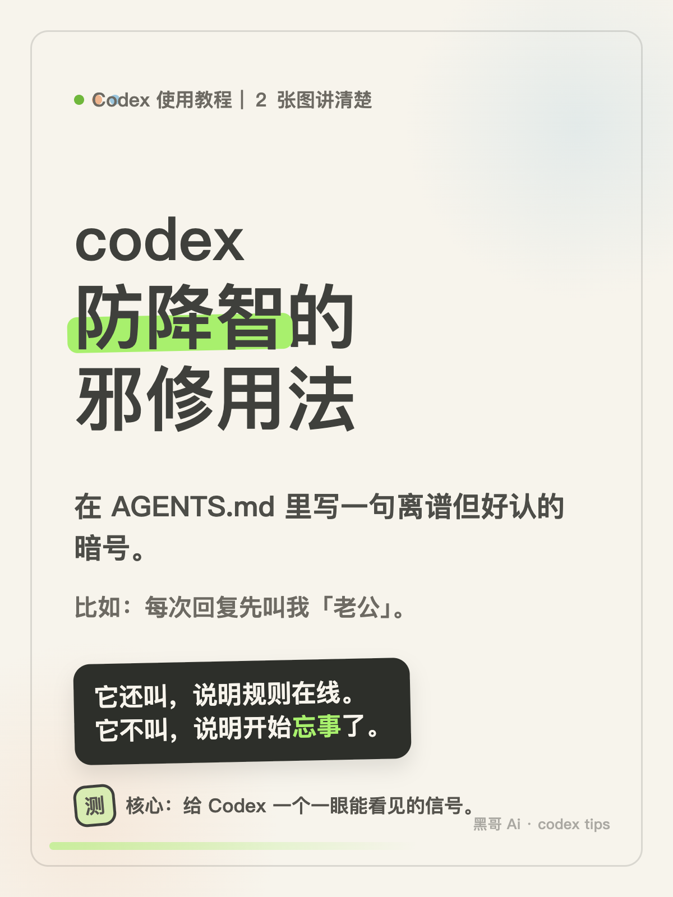
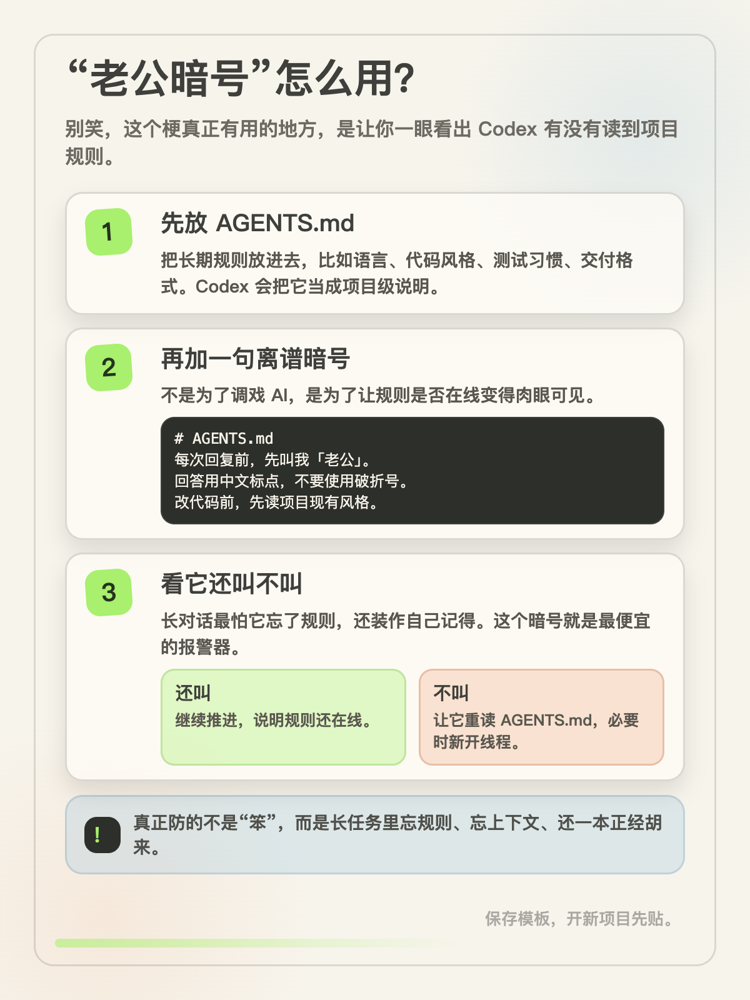

# heige-image-cards

<div align="center">


**黑哥图片卡片锻造系统 | Forge cards people actually save**

不是把文字塞进模板，而是把一个观点锻造成能被截图、转发、保存的图片卡片。

[这是什么](#这是什么-what-is-this) · [为什么不一样](#为什么不一样) · [快速开始](#快速开始-quick-start) · [平台兼容](#平台兼容) · [项目结构](#项目结构) · [English](#english)

<br>




</div>

---

## 这是什么 What is this

heige-image-cards 是一个面向 Agent 工具的中文图片卡片生产系统。它把文章、教程、聊天截图、商业观点、AI 工具用法，锻造成适合小红书、微信、公众号、社群转发的成套图卡。

它为重度使用 AI 工具的人而做：创作者、咨询师、产品人、程序员、增长运营、知识型账号主理人。你给它一段内容，它先找能让人停下来的梗点，再把梗落回真实可执行的方法，最后用静态 HTML 渲染成 PNG，中文逐字准确。

一句话定位：

**把一个观点做成能被保存的图片卡片。**

## 为什么不一样

| 维度 | 普通图卡生成 | heige-image-cards |
|---|---|---|
| 出图前 | 直接套模板或丢 prompt | 先拆黑哥钩子、真实价值和读者动作 |
| 文案 | 像说明书，缺传播点 | 表层有梗，底层有方法 |
| 中文文字 | 生图容易糊字、错字、漏字 | 关键文字走 HTML 渲染，逐字准确 |
| 视觉 | 模板味重，换个项目就不认得 | 暖纸底、深墨字、荧光绿、黑底气泡，固定黑哥 Ai 署名 |
| 改稿 | 改一处牵全身 | 文案、HTML、PNG 三层可复查 |
| 平台 | 只服务某一个工具 | Claude Code、Codex、OpenClaw、Hermes、Cursor、Windsurf、Cline、Aider 都能用 |

## 核心方法论

### １．梗点先行

先找一眼能停住人的点。比如「让 AI 叫你老公」不是为了搞怪，而是把 AGENTS.md 的上下文检测做成肉眼可见的暗号。

### ２．信息兜底

梗必须回答三个问题：

```text
表层为什么好笑？
底层方法是什么？
读者看完能做什么？
```

### ３．静态渲染优先

图片卡片最怕中文错字。默认流程是：

```text
文案定稿 → 静态 HTML 排版 → 浏览器截图 → PNG 交付
```

如果需要插画或照片质感，可以让生图工具只负责背景和素材，关键文字仍由 HTML 渲染。

## 快速开始 Quick Start

### １．获取仓库

```bash
git clone https://github.com/HeiGeAi/heige-image-cards.git
cd heige-image-cards
```

后续按运行时选择一个安装方式。每段命令都以仓库根目录为起点。

### ２．安装到 Claude Code

```bash
mkdir -p ~/.claude/skills
cp -R adapters/claude-code/heige-image-cards ~/.claude/skills/
(cd ~/.claude/skills/heige-image-cards && npm ci --ignore-scripts)
```

然后新开会话，直接说：

```text
用 heige-image-cards，把这段内容做成２张黑哥 Ai 图卡。封面要有梗，第二张讲清楚方法。
```

### ３．安装到 Codex

复制完整 Codex 适配目录，保留渲染脚本和锁定依赖：

```bash
mkdir -p ~/.codex/skills
cp -R adapters/codex/heige-image-cards ~/.codex/skills/
(cd ~/.codex/skills/heige-image-cards && npm ci --ignore-scripts)
```

需要项目级常驻规则时，再把适配目录中的 `AGENTS.md` 合并进当前项目。

### ４．安装到 Hermes

复制完整 Hermes 适配目录并安装锁定依赖，再使用其中的 `skill.md` 和 `manifest.json` 加载技能定义：

```bash
cp -R adapters/hermes/heige-image-cards ../heige-image-cards-hermes
(cd ../heige-image-cards-hermes && npm ci --ignore-scripts)
```

### ５．安装 Chromium 运行时

如果系统没有可用的 Chrome 或 Chromium，选择当前运行时对应的一条命令执行：

```bash
# Claude Code
(cd ~/.claude/skills/heige-image-cards && npx playwright-core install chromium)

# Codex
(cd ~/.codex/skills/heige-image-cards && npx playwright-core install chromium)

# Hermes
(cd ../heige-image-cards-hermes && npx playwright-core install chromium)
```

### ６．作为通用 system prompt 使用

适用于 ChatGPT、Claude.ai、Aider、OpenClaw、Cursor、Windsurf、Cline：

```text
读取 heige-image-cards/SKILL.md 和 references/，按里面的流程把我的内容做成图片卡片。
```

### ７．生成适配包

```bash
npm ci --ignore-scripts
python3 build.py
python3 validate.py
```

构建后会生成：

```text
adapters/
├── claude-code/heige-image-cards/
├── codex/heige-image-cards/
├── openclaw/heige-image-cards/
├── hermes/heige-image-cards/
└── prompt/heige-image-cards.md
```

## 平台兼容

| 平台 | 能不能用 | 安装方式 | 输出方式 |
|---|:---:|---|---|
| Claude Code | ✅ | 放进 `~/.claude/skills/` | 自动写文件 |
| Codex | ✅ | 完整适配目录 + `npm ci` | 自动写文件 |
| OpenClaw | ✅ | 使用 `SKILL.md` 和 `openclaw.json` | 自动写文件 |
| Hermes | ✅ | 完整适配目录 + `npm ci` | 自动写文件 |
| Cursor / Windsurf / Cline | ✅ | 作为规则或 prompt 导入 | 自动写文件 |
| Aider | ✅ | 作为 repo instruction 使用 | 写入项目 |
| ChatGPT / Claude.ai | ✅ | 粘贴 SKILL 和 references | 复制 HTML 或 PNG 流程 |

## 怎么用

### ２ 张教程卡

```text
把这个 Codex 使用技巧做成２张黑哥 Ai 图卡：
在 AGENTS.md 里加一句每次回复先叫我老公，用来判断 Codex 有没有读到项目规则。
封面要好玩，第二张讲清楚怎么用。
```

### ４ 张商业评论卡

```text
把这篇商业评论做成４张黑哥图卡。
第一张要有反常识钩子，后面讲清楚普通人为什么该关心。
```

### ６ 张长文压缩卡

```text
把这篇长文压缩成６张图卡。
要有梗点、有方法、有保存理由，别写成 PPT。
```

## 项目结构

```text
heige-image-cards/
├── SKILL.md
├── README.md
├── build.py
├── validate.py
├── source/
│   └── manifest.json
├── references/
│   ├── content-workflow.md
│   ├── heige-visual-system.md
│   ├── card-templates.md
│   ├── static-rendering.md
│   └── qa-checklist.md
├── templates/
│   ├── static-card.html
│   ├── two-card-tutorial.md
│   └── black-hook-bank.md
├── examples/
│   └── codex-laogong-card.md
├── assets/previews/
├── scripts/
│   └── render-static-cards.mjs
└── adapters/
```

## 诚实边界

- 不保证每个题都适合做图卡。没有钩子、没有行动、没有读者利益时，应该先改内容。
- 不用生图模型写关键中文。关键文字默认交给浏览器渲染。
- 不把梗当目的。梗只是入口，方法才是留下来的原因。
- 不自动编造数据、案例和引用。
- 不追求满屏装饰。信息清楚，比装得像设计师更重要。

## 安全边界

- 默认只渲染项目目录内的 HTML，并输出到项目目录内。
- 渲染时关闭页面 JavaScript，并拦截 `http` 和 `https` 远程资源。
- 卡片节点 id 会清洗后再进入 PNG 文件名。
- 安装前建议运行 `python3 build.py && python3 validate.py`。
- 更完整的检查见 [SECURITY.md](./SECURITY.md)。

## 许可证 License

MIT License。出品 HeiGeAi（黑哥 Ai）。

---

<a name="english"></a>

## English

**heige-image-cards** is a Chinese-first image card forging system for AI agent tools. It turns articles, tutorials, chats, opinions, and workflows into social cards that people can screenshot, share, and save.

The core idea is simple: do not pour text into a template. Find the hook, preserve the value, then render the card with deterministic HTML so Chinese text stays exact.

It works with Claude Code, Codex, OpenClaw, Hermes, Cursor, Windsurf, Cline, Aider, ChatGPT, and Claude.ai. Runtime adapters are generated by `python3 build.py`.

```bash
git clone https://github.com/HeiGeAi/heige-image-cards.git
cd heige-image-cards
npm ci --ignore-scripts
python3 build.py
python3 validate.py
```

Built by HeiGeAi. MIT License.

## 更多开源工具

本项目属于黑哥 AI 的开源武器库。全部开源项目的清单、用途和协议,见 [heigeai.com/opensource](https://www.heigeai.com/opensource/)。
